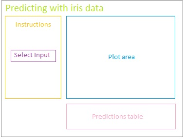
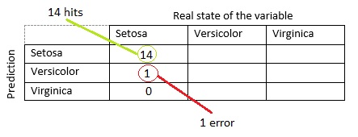

## The data set
Iris is a data set very used in the course, it has data of the petals and sepals of different kind of plants. I will be using it to train some models and then predict the kind od species based in the rest of the variables. 

```r
data(iris)
head(iris)
```

```
##   Sepal.Length Sepal.Width Petal.Length Petal.Width Species
## 1          5.1         3.5          1.4         0.2  setosa
## 2          4.9         3.0          1.4         0.2  setosa
## 3          4.7         3.2          1.3         0.2  setosa
## 4          4.6         3.1          1.5         0.2  setosa
## 5          5.0         3.6          1.4         0.2  setosa
## 6          5.4         3.9          1.7         0.4  setosa
```

---

## The app
The application takes the data set and generates two partitions, one for training and one for testing.
The selector allows you to choose the model to train and visualize. When choosing, a graph will be displayed that helps the user understand the trained model.
A table of the predictions versus the actual status of the Species variable in the test set is also shown at the bottom.




--- 

## The methods
I use four methods to train the models.
- Decision Trees
- Random Forest
- Boosting with Trees
- K-means

---

## The code for models
This is some of the code for the trained models. 

```r
set.seed(6895)
    inTrain <- createDataPartition(y=iris$Species, p=0.7, list=FALSE)
    training <- iris[inTrain,]
    testing <- iris[-inTrain,]
    ##Models
    mod1 <- train(Species ~., method="rpart", data=training)
    mod2 <- ctree(Species~., data = training)
    mod3 <- train(Species~., method="gbm", data=training, verbose=FALSE)
    mod4 <- kmeans(subset(training, select=-c(Species)), centers=3)
    training$clusters <- as.factor(mod4$cluster)
```

---

## The code for plots
This is the code for one of the outputs

```r
 output$distPlot <- renderPlot({

        if(input$Method=="Decision Trees"){
            # draw the resulting tree
            fancyRpartPlot(mod1$finalModel)
        } else if(input$Method=="Random Forest"){
            plot(mod2,type="simple")
        } else if(input$Method=="Boosting with Trees"){
            qplot(predict(mod3,testing),Species,data=testing)
        } else if (input$Method=="K-means"){
            qplot(training$Petal.Width, training$Petal.Length, colour=clusters, data = training)
        }

    })
```

---

## The predictions table

Once I have the model trained, I make the predictions with the test data set. Using the function 'predict' you get the table shown at the bottom of the app.
On the left side is the state of the prediction (setosa, versicolor and virginica), at the top of the table we have the real state of the variable. when comparing them the count is made. That is, if we compare setosa (prediction) and setosa (real state) we can see the number of predictions that matched the real state. We can see the errors when there is a count in a prediction that is different from the real state.



---
## Thanks
This is it. Feel free to leave comments.
